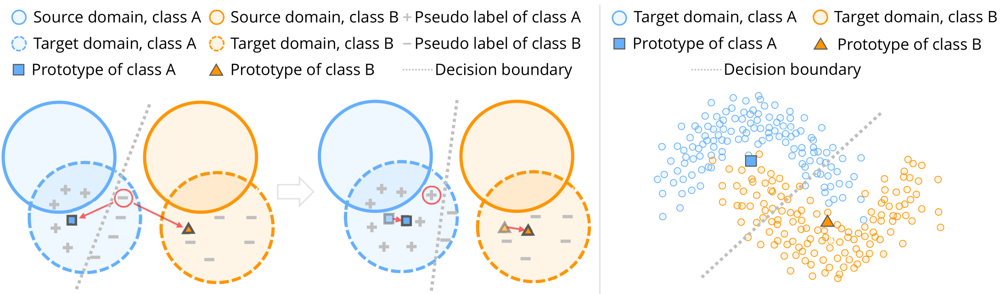
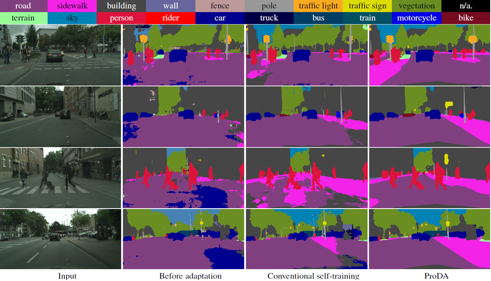

# Prototypical Pseudo Label Denoising and Target Structure Learning for Domain Adaptive Semantic Segmentation (CVPR 2021, official Pytorch implementation)

### [Paper](https://arxiv.org/abs/2101.10979)
<!-- <br> -->
[Pan Zhang](https://panzhang0212.github.io/),  [Bo Zhang](https://bo-zhang.me/), [Ting Zhang](https://www.microsoft.com/en-us/research/people/tinzhan/), [Dong Chen](https://www.microsoft.com/en-us/research/people/doch/),  [Yong Wang](https://auto.ustc.edu.cn/en/teacher-detail.php?i=19), and [Fang Wen](https://www.microsoft.com/en-us/research/people/fangwen/).
<!-- <br> -->



## Abstract
>Self-training is a competitive approach in domain adaptive segmentation, which trains the network with the pseudo labels on the target domain. However inevitably, the pseudo
labels are noisy and the target features are dispersed due to the discrepancy between source and target domains. In this
paper, we rely on representative prototypes, the feature centroids of classes, to address the two issues for unsupervised
domain adaptation. In particular, we take one step further and exploit the feature distances from prototypes that provide
richer information than mere prototypes. Specifically, we use it to estimate the likelihood of pseudo labels to facilitate
online correction in the course of training. Meanwhile, we align the prototypical assignments based on relative feature
distances for two different views of the same target, producing a more compact target feature space. Moreover,
we find that distilling the already learned knowledge to a self-supervised pretrained model further boosts the performance.
Our method shows tremendous performance advantage over state-of-the-art methods.

## Installation
Install dependencies:
```bash
pip install -r requirements.txt
```

## Data Preparation 
Download [Cityscapes](https://www.cityscapes-dataset.com/), [GTA5](https://download.visinf.tu-darmstadt.de/data/from_games/) and [SYNTHIA-RAND-CITYSCAPES](http://synthia-dataset.net/downloads/).

## Inference Using Pretrained Model

<details>
  <summary>
    <b>1) GTA5 -> Cityscapes</b>
  </summary>
  
Download the [pretrained model](https://drive.google.com/file/d/1MTtbLKtqhNI1Ec6GGfBLnqQP2u9igKWn/view?usp=sharing) (57.5 mIoU) and save it in `./pretrained/gta2citylabv2_stage3`. Then run the command 
```bash
python test.py --bn_clr --student_init simclr --resume ./pretrained/gta2citylabv2_stage3/from_gta5_to_cityscapes_on_deeplabv2_best_model.pkl
```
</details>

<details>
  <summary>
    <b>2) SYNTHIA -> Cityscapes</b>
  </summary>
  
Download the [pretrained model](https://drive.google.com/file/d/1oiGPe6c4WfYi-5pYaejOa6L4WA98Ds63/view?usp=sharing) (55.5 mIoU, 62.0 mIoU for 16, 13 categories respectively) and save it in `./pretrained/syn2citylabv2_stage3`. Then run the command 
```bash
python test.py --bn_clr --student_init simclr --n_class 16 --resume ./pretrained/syn2citylabv2_stage3/from_synthia_to_cityscapes_on_deeplabv2_best_model.pkl
```
</details>

## Training
To reproduce the performance, you need 4 GPUs with no less than 16G memory.
<details>
  <summary>
    <b>1) GTA5 -> Cityscapes</b>
  </summary>
   
- **Stage1.** Download [warm-up model](https://drive.google.com/file/d/1X7AyDtm4DC2WET-xX2b39x8aSkrD266f/view?usp=sharing) (43.3 mIoU), and save it in `./pretrained/gta2citylabv2_warmup/`.
    * Generate soft pseudo label.
    ```bash
    python generate_pseudo_label.py --name gta2citylabv2_warmup_soft --soft --resume_path ./pretrained/gta2citylabv2_warmup/from_gta5_to_cityscapes_on_deeplabv2_best_model.pkl --no_droplast 
    ```
    * Calculate initial prototypes.
    ```bash
    python calc_prototype.py --resume_path ./pretrained/gta2citylabv2_warmup/from_gta5_to_cityscapes_on_deeplabv2_best_model.pkl
    ```
    * Train stage1.
    ```bash
    python train.py --name gta2citylabv2_stage1Denoise --used_save_pseudo --ema --proto_rectify --moving_prototype --path_soft Pseudo/gta2citylabv2_warmup_soft --resume_path ./pretrained/gta2citylabv2_warmup/from_gta5_to_cityscapes_on_deeplabv2_best_model.pkl --proto_consistW 10 --rce --regular_w 0.1
    ```

- **Stage2.** This stage needs well-trained model from stage1 as teacher model. You can get it by above command or download the pretrained model [stage1 model](https://drive.google.com/file/d/15masr_JcYk6nj73ySiY8HJw__pQEyBfV/view?usp=sharing)(53.7 mIoU) and save it in `./pretrained/gta2citylabv2_stage1Denoise/` (path of `resume_path`). Besides, download the pretrained model [simclr model](https://drive.google.com/file/d/1IHT-n-ko2DRWXNaW8OvvYktn_5VQYd2C/view?usp=sharing) and save it to `./pretrained/simclr/`.
    * Generate pseudo label.
    ```bash
    python generate_pseudo_label.py --name gta2citylabv2_stage1Denoise --flip --resume_path ./logs/gta2citylabv2_stage1Denoise/from_gta5_to_cityscapes_on_deeplabv2_best_model.pkl --no_droplast
    ```
    * Train stage2.
    ```bash
    python train.py --name gta2citylabv2_stage2 --stage stage2 --used_save_pseudo --path_LP Pseudo/gta2citylabv2_stage1Denoise --resume_path ./logs/gta2citylabv2_stage1Denoise/from_gta5_to_cityscapes_on_deeplabv2_best_model.pkl --S_pseudo 1 --threshold 0.95 --distillation 1 --finetune --lr 6e-4 --student_init simclr --bn_clr --no_resume
    ```

- **Stage3.** This stage needs well-trained model from stage2 as the teacher model. You can get it with the above command or download the pretrained model [stage2 model](https://drive.google.com/file/d/1Putk_jWqKpYwh1liTZyYxREnqBQhGNDo/view?usp=sharing)(56.9 mIoU) and save it in `./pretrained/gta2citylabv2_stage2/` (path of `resume_path`).
    * Generate pseudo label.
    ```bash
    python generate_pseudo_label.py --name gta2citylabv2_stage2 --flip --resume_path ./logs/gta2citylabv2_stage2/from_gta5_to_cityscapes_on_deeplabv2_best_model.pkl --no_droplast --bn_clr --student_init simclr
    ```
    * Train stage3.
    ```bash
    python train.py --name gta2citylabv2_stage3 --stage stage3 --used_save_pseudo --path_LP Pseudo/gta2citylabv2_stage2 --resume_path ./logs/gta2citylabv2_stage2/from_gta5_to_cityscapes_on_deeplabv2_best_model.pkl --S_pseudo 1 --threshold 0.95 --distillation 1 --finetune --lr 6e-4 --student_init simclr --bn_clr --ema_bn
    ```
    
</details>


<details>
  <summary>
    <b>2) SYNTHIA -> Cityscapes</b>
  </summary>

- **Stage1.** Download [warmup model](https://drive.google.com/file/d/1RpjnA8ncHqR90LeWEHE4p9wSI251KLW_/view?usp=sharing)(41.4 mIoU), save it in `./pretrained/syn2citylabv2_warmup/`.
    * Generate soft pseudo label.
    ```bash
    python generate_pseudo_label.py --name syn2citylabv2_warmup_soft --soft --n_class 16 --resume_path ./pretrained/syn2citylabv2_warmup/from_synthia_to_cityscapes_on_deeplabv2_best_model.pkl --no_droplast 
    ```
    * Calculate initial prototypes.
    ```bash
    python calc_prototype.py --resume_path ./pretrained/syn2citylabv2_warmup/from_synthia_to_cityscapes_on_deeplabv2_best_model.pkl --n_class 16
    ```
    * Train stage1.
    ```bash
    python train.py --name syn2citylabv2_stage1Denoise --src_dataset synthia --n_class 16 --src_rootpath src_rootpath --used_save_pseudo --path_soft Pseudo/syn2citylabv2_warmup_soft --ema --proto_rectify --moving_prototype --proto_consistW 10 --resume_path ./pretrained/syn2citylabv2_warmup/from_synthia_to_cityscapes_on_deeplabv2_best_model.pkl --rce
    ```

- **Stage2.** This stage needs well-trained model from stage1 as teacher model. You can get it by above command or download released pretrained [stage1 model](https://drive.google.com/file/d/180buGBRRnj5eNa0MW-GuKH6n5zS-eQSA/view?usp=sharing)(51.9 mIoU) and save it in `./pretrained/syn2citylabv2_stage1Denoise/` (path of `resume_path`).
    * Generate pseudo label.
    ```bash
    python generate_pseudo_label.py --name syn2citylabv2_stage1Denoise --flip --resume_path ./logs/syn2citylabv2_stage2/from_synthia_to_cityscapes_on_deeplabv2_best_model.pkl --no_droplast --n_class 16
    ```
    * Train stage2.
    ```bash
    python train.py --name syn2citylabv2_stage2 --stage stage2 --src_dataset synthia --n_class 16 --src_rootpath src_rootpath --used_save_pseudo --path_LP Pseudo/syn2citylabv2_stage1Denoise --resume_path ./logs/syn2citylabv2_stage2/from_synthia_to_cityscapes_on_deeplabv2_best_model.pkl --S_pseudo 1 --threshold 0.95 --distillation 1 --finetune --lr 6e-4 --student_init simclr --bn_clr --no_resume
    ```

- **Stage3.** This stage needs well-trained model from stage2 as teacher model. You can get it by above command or download released pretrained [stage2 model](https://drive.google.com/file/d/1ERemuuQ0LZ7CphXMNyHAPBuVIkV2RCQH/view?usp=sharingg)(54.6 mIoU) and save it in `./pretrained/stn2citylabv2_stage2/` (path of `resume_path`).
    * Generate pseudo label.
    ```bash
    python generate_pseudo_label.py --name syn2citylabv2_stage2 --flip --resume_path ./logs/syn2citylabv2_stage2/from_synthia_to_cityscapes_on_deeplabv2_best_model.pkl --no_droplast --bn_clr --student_init simclr --n_class 16
    ```
    * Train stage3.
    ```bash
    python train.py --name syn2citylabv2_stage3 --stage stage3 --src_dataset synthia --n_class 16 --src_rootpath src_rootpath --used_save_pseudo --path_LP Pseudo/syn2citylabv2_stage2 --resume_path ./logs/syn2citylabv2_stage2/from_synthia_to_cityscapes_on_deeplabv2_best_model.pkl --S_pseudo 1 --threshold 0.95 --distillation 1 --finetune --lr 6e-4 --student_init simclr --bn_clr --ema_bn
    ```
    
</details>

## Citation
If you like our work and use the code or models for your research, please cite our work as follows.
```
@article{zhang2021prototypical,
    title={Prototypical Pseudo Label Denoising and Target Structure Learning for Domain Adaptive Semantic Segmentation},
    author={Zhang, Pan and Zhang, Bo and Zhang, Ting and Chen, Dong and Wang, Yong and Wen, Fang},
    journal={arXiv preprint arXiv:2101.10979},
    year={2021}
}
```

## License

The codes and the pretrained model in this repository are under the MIT license as specified by the LICENSE file. 

This project has adopted the [Microsoft Open Source Code of Conduct](https://opensource.microsoft.com/codeofconduct/). For more information see the [Code of Conduct FAQ](https://opensource.microsoft.com/codeofconduct/faq/) or contact [opencode@microsoft.com](mailto:opencode@microsoft.com) with any additional questions or comments.

## Acknowledgments
This code is heavily borrowed from [CAG_UDA](https://github.com/RogerZhangzz/CAG_UDA).  
We also thank Jiayuan Mao for his [Synchronized Batch Normalization code](https://github.com/vacancy/Synchronized-BatchNorm-PyTorch).
